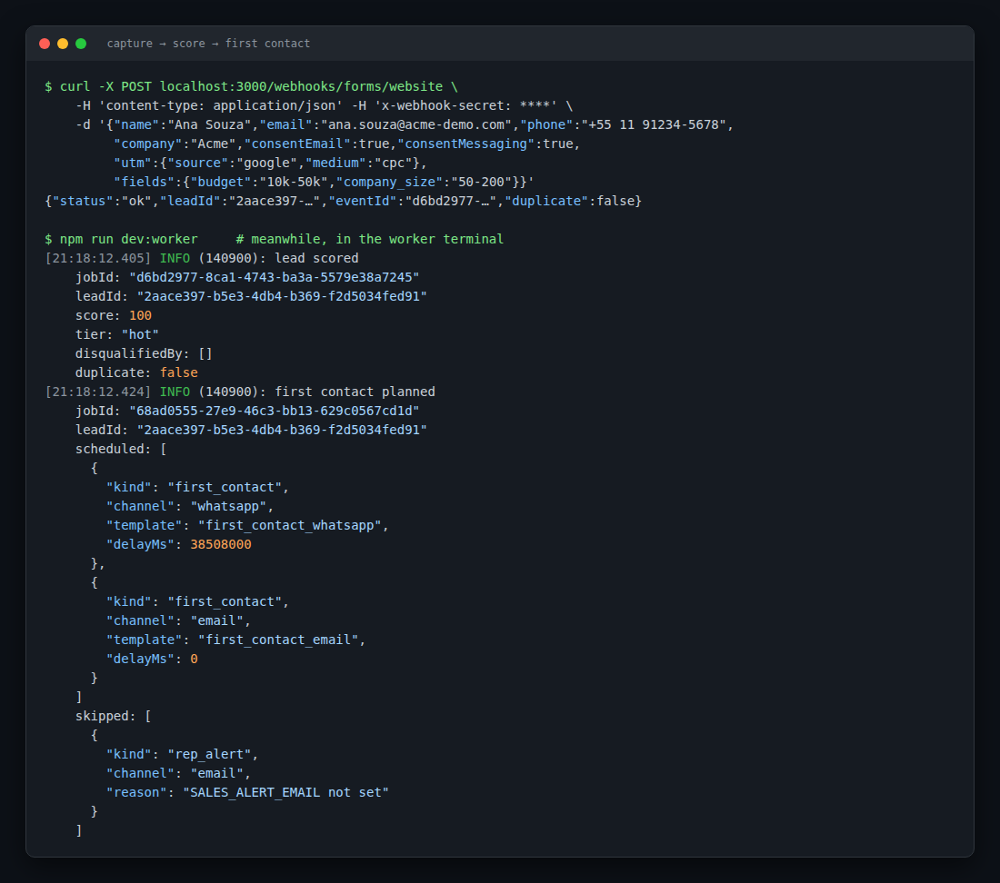
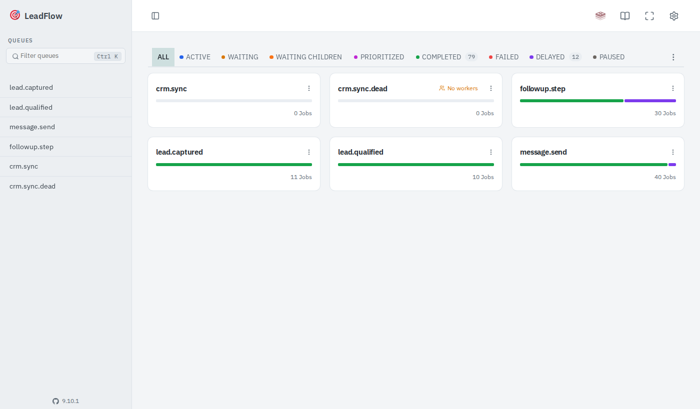
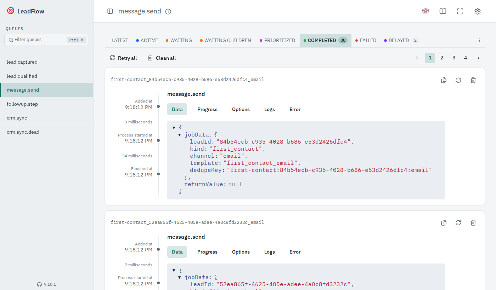
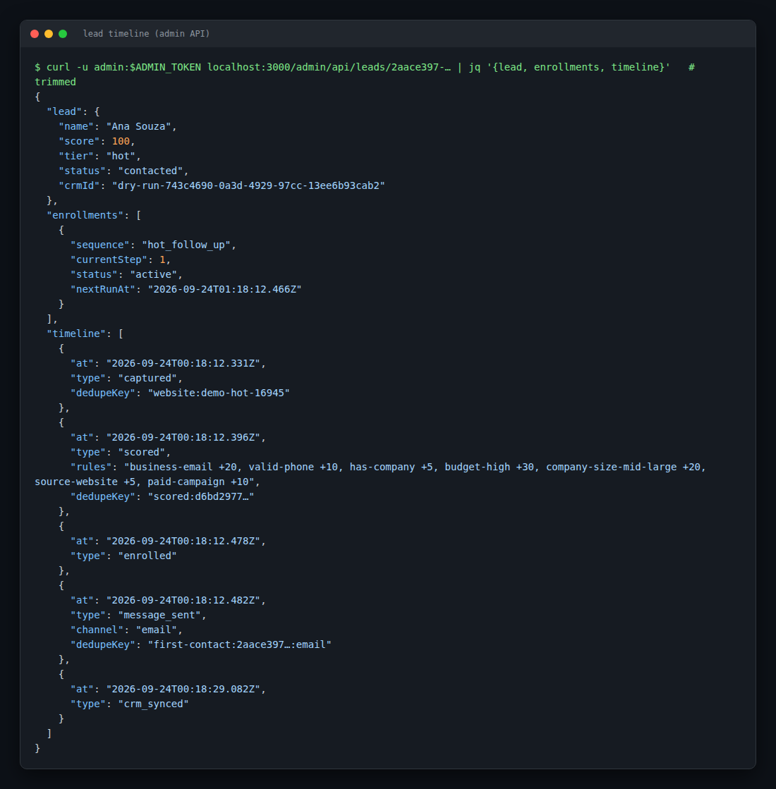
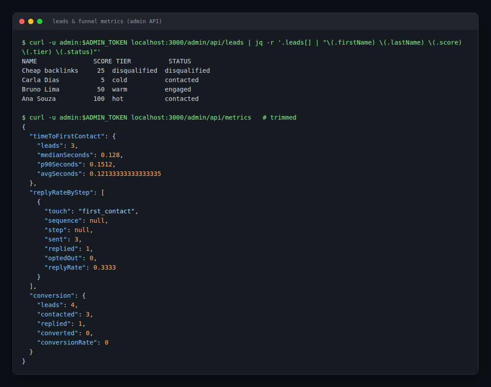

# LeadFlow

**Automated lead follow-up: from form submission to CRM in under a second, with no manual work.**

LeadFlow captures leads from web forms, scores them against configurable rules, contacts them right away over WhatsApp and email, follows up on a schedule until they reply, and keeps HubSpot up to date. Every step is written to an append-only audit trail, and every job is idempotent, so retries and duplicate webhooks never send a message twice.

```
form webhook ─▶ capture ─▶ qualification ─▶ first contact ─▶ follow-up sequence ─▶ CRM sync
                 (dedupe)    (hot/warm/cold)   (WhatsApp/email)   (stops on reply or opt-out)
```


---

## Screenshots

**A lead going through the pipeline.** One form POST is captured, scored as `hot` (100 points), and gets its first contact planned. Email goes out immediately. WhatsApp is held until quiet hours end (`delayMs`).



**Queue dashboard (Bull Board at `/admin/queues`).** Every pipeline stage is its own BullMQ queue. Delayed jobs are scheduled follow-ups and messages waiting out quiet hours.



**Job details.** Job ids come from the stage's dedupe key, which is what makes re-enqueueing safe.



**Lead timeline (admin API).** The audit trail for one lead: captured → scored (with the rules that matched) → enrolled in a follow-up sequence → message sent → synced to the CRM.



**Leads and funnel metrics.** A hot, a warm, a cold and a spam lead. The warm lead replied, which stopped its sequence and moved it to `engaged`. Metrics show time to first contact, reply rate per touch and conversion.



> Screenshots come from a local run in `dry-run` mode, where messages and CRM calls are logged instead of sent.

---

## Features

### Capture

- Webhook endpoint per form provider (`POST /webhooks/forms/:provider`). Website forms (shared secret) and **Typeform** (HMAC signature, checked against the raw request bytes).
- Normalization: E.164 phone numbers, lowercase emails, name splitting, UTM parameters, timezone.
- **Deduplication and merging**: retries of the same submission are ignored, and a returning person (same email or phone) is merged into the existing lead.

### Qualification

- A **rule engine driven by JSON** (`config/scoring.json`): points per rule, `hot`/`warm`/`cold` thresholds, and disqualifiers (no consent, disposable email domain, spam content…).
- Nested `any`/`all` conditions and operators (`eq`, `in`, `gte`, `exists`, `matches`…). Scoring changes need no code.
- Every rule in the shipped config is covered by a test, and a test enforces that.

### First contact and follow-up

- Channel strategy per tier (`config/contact.json`). For example, hot leads get WhatsApp + email and a sales rep alert.
- **Quiet hours** per lead timezone for WhatsApp/SMS.
- Templates and follow-up sequences are **stored in the database** (hot: 1h / 1d / 3d, warm: 1d / 3d / 7d, cold: 3d / 7d / 14d).
- Adapters: **WhatsApp Cloud API**, **Resend** (email), plus `dry-run` for development. Permanent failures and retryable failures are handled separately.

### Replies and opt-out

- Inbound WhatsApp (Meta webhook, signature verified) and inbound email.
- A reply **stops the sequence**, marks the lead `engaged` and alerts the rep.
- Opt-out keywords (`STOP`, `SAIR`, `CANCELAR`…) and a signed one-click **unsubscribe link**.

### CRM sync (HubSpot)

- Pull-based sync: pushes the contact, maps the lifecycle stage and logs each event as a CRM activity.
- Cursor-based, so nothing is sent twice. Handles CRM rate limits (queue-wide backoff) and has a **dead-letter queue** plus a requeue command.
- HubSpot → LeadFlow webhooks (for example, a contact moved to the `customer` lifecycle stage converts the lead).

### Operations

- **Admin API** (`/admin/api`): leads (keyset pagination), lead timeline, pause/resume sequences, queue stats, retry failed jobs, CRM requeue.
- **Metrics**: time to first contact (median/p90), reply rate per sequence step, conversion by source and tier, send failure rates.
- **Alerts** for queue backlog, stuck jobs and send failures, posted to Slack, with a Redis-backed cooldown so several workers notify only once.
- **Bull Board** queue UI behind the admin token.

### Privacy and hardening (LGPD/GDPR)

- **Consent ledger**: each capture records which purposes were granted, with evidence (text shown, IP, page URL).
- **Suppression list** of hashed addresses that must never be contacted again, checked on every capture.
- **Right to access / erasure** endpoints, plus automatic **data retention** that erases inactive leads.
- Per-IP **rate limiting** (Redis-backed, fails open), `trust proxy` configuration, readiness checks.

---

## Architecture

```
                 ┌────────────────────────── API (Fastify) ──────────────────────────┐
 Form/Typeform ─▶│ /webhooks/forms    /webhooks/replies    /unsubscribe    /admin/*  │
 WhatsApp/email ▶│      │                    │                                       │
 HubSpot ───────▶│      ▼                    ▼                                       │
                 │  captureLead         handleInbound  ──▶ PostgreSQL (Prisma)       │
                 └──────┬────────────────────────────────────────▲────────────────────┘
                        │ enqueue (job id = event id)            │
                        ▼                                        │
                 ┌──────────── Redis / BullMQ ───────────┐       │
                 │ lead.captured → lead.qualified →      │       │
                 │ message.send ⇄ followup.step          │       │
                 │ crm.sync (→ crm.sync.dead)            │       │
                 └──────┬────────────────────────────────┘       │
                        ▼                                        │
                 ┌──────────── Worker ───────────────────┐       │
                 │ qualifyLead · planFirstContact ·      │───────┘
                 │ sendMessage · runStep · syncLead      │──▶ WhatsApp / Resend / HubSpot
                 │ + reconcile, CRM sweep, alerts,       │
                 │   retention (periodic)                │
                 └───────────────────────────────────────┘
```

Design choices worth highlighting:

- **Idempotency everywhere.** Each stage writes a `LeadEvent` with a unique `dedupeKey` derived from its input and enqueues the next job using the event id as the job id. A crash between "write" and "enqueue" is fixed by a plain retry, with no duplicates.
- **Append-only audit trail.** `LeadEvent` is the single source for the timeline, the metrics and the CRM activity feed.
- **Testable by construction.** `buildApp(deps)` takes every dependency as an argument, and adapters take `fetch` as a parameter. Unit tests run with fakes and no network. A separate DB suite runs the real pipeline end to end on isolated queues.
- **Configuration as data.** Scoring rules, channel strategy, quiet hours, CRM stage mapping, templates and sequences can all change without a deploy.

**Stack:** TypeScript (ESM, strict) · Node ≥ 20 · Fastify 5 · PostgreSQL + Prisma 7 · Redis + BullMQ · Zod 4 · Vitest · Docker · GitHub Actions.

---

## Getting started

You need **Node 20+** and **Docker**.

### 1. Install and start the infrastructure

```bash
git clone https://github.com/lucasrocha20/LeadFlow.git
cd LeadFlow
npm install
cp .env.example .env
docker compose up -d --wait     # Postgres + Redis
```

> If ports 5432/6379/3000 are already taken, change `POSTGRES_PORT`, `REDIS_PORT`, `PORT` and the ports in `DATABASE_URL`/`REDIS_URL` in `.env`.

### 2. Enable the endpoints you want to try

Webhooks and the admin area are off until their secret is set. Edit `.env`:

```bash
FORM_WEBHOOK_SECRET=my-form-secret
REPLY_WEBHOOK_SECRET=my-reply-secret
ADMIN_TOKEN=my-admin-token-at-least-24-chars
```

Keep `MESSAGING_PROVIDER`, `EMAIL_PROVIDER` and `CRM_PROVIDER` on `dry-run` for now. Nothing is really sent: messages and CRM calls are written to the worker log.

### 3. Create the database and run

```bash
npm run db:deploy     # apply migrations
npm run db:seed       # default templates and follow-up sequences

npm run dev           # terminal 1: API on http://localhost:3000
npm run dev:worker    # terminal 2: background worker
```

Check it: `curl localhost:3000/health/ready` → `{"status":"ok","checks":{"redis":"ok","database":"ok"}}`

---

## Try it: a hands-on walkthrough

These commands assume the secrets from step 2 and port 3000.

**1. Submit a hot lead**

```bash
curl -X POST localhost:3000/webhooks/forms/website \
  -H 'content-type: application/json' \
  -H 'x-webhook-secret: my-form-secret' \
  -d '{
    "submissionId": "demo-1",
    "name": "Ana Souza",
    "email": "ana@acme-demo.com",
    "phone": "+55 11 91234-5678",
    "company": "Acme",
    "consentEmail": true,
    "consentMessaging": true,
    "utm": { "source": "google", "medium": "cpc" },
    "fields": { "budget": "10k-50k", "company_size": "50-200" }
  }'
```

In the worker terminal you'll see `lead scored` (score 100, tier `hot`), `first contact planned`, and a `dry-run message` with the rendered text. Send the same request again and the response says `"duplicate": true`.

**2. Try other profiles.** Change the payload to see qualification at work:

| Payload change                                                                | Result                           |
| ----------------------------------------------------------------------------- | -------------------------------- |
| `gmail.com` email, no phone, no `fields`                                      | `cold`: one email, slow sequence |
| `"fields": { "budget": "5k-10k" }` with a phone                               | `warm`                           |
| `mailinator.com` email, or `"consentEmail": false, "consentMessaging": false` | `disqualified`: never contacted  |

**3. Reply as the lead.** This stops the follow-up sequence and marks the lead `engaged`:

```bash
curl -X POST localhost:3000/webhooks/replies/email \
  -H 'content-type: application/json' \
  -H 'x-webhook-secret: my-reply-secret' \
  -d '{ "from": "Ana Souza <ana@acme-demo.com>", "text": "Sounds good, call me Thursday", "messageId": "<r1@mail>" }'
```

Reply with `"text": "STOP"` instead to see the opt-out: consent is withdrawn and the address is suppressed.

**4. Inspect it**

```bash
TOKEN=my-admin-token-at-least-24-chars
curl -u admin:$TOKEN localhost:3000/admin/api/leads             # list
curl -u admin:$TOKEN localhost:3000/admin/api/leads/<leadId>    # timeline + enrollments
curl -u admin:$TOKEN localhost:3000/admin/api/metrics           # funnel metrics
curl -u admin:$TOKEN localhost:3000/admin/api/queues            # queue stats
```

Open **http://localhost:3000/admin/queues** in a browser (any username, the token as password) for the Bull Board UI. The CRM sync runs every 30 seconds. Soon after that, the timeline shows a `crm_synced` event.

To browse the database directly: `npm run db:studio`.

---

## Testing for real (actual messages and CRM)

Once the dry run works, switch one provider at a time in `.env` and restart the API and worker. **Use your own email/phone as the lead.**

| What                          | Settings                                                                                     | Notes                                                                                                                                                              |
| ----------------------------- | -------------------------------------------------------------------------------------------- | ------------------------------------------------------------------------------------------------------------------------------------------------------------------ |
| **Email** (Resend)            | `EMAIL_PROVIDER=resend`, `RESEND_API_KEY`, `EMAIL_FROM="You <you@your-verified-domain.com>"` | On the free tier without a verified domain, Resend only delivers to your own account email.                                                                        |
| **WhatsApp** (Meta Cloud API) | `MESSAGING_PROVIDER=whatsapp`, `WHATSAPP_ACCESS_TOKEN`, `WHATSAPP_PHONE_NUMBER_ID`           | Use the test number from Meta's developer dashboard and add your phone as a recipient. Business-initiated messages outside the 24h window need approved templates. |
| **Inbound WhatsApp replies**  | `WHATSAPP_APP_SECRET`, `WHATSAPP_WEBHOOK_VERIFY_TOKEN`                                       | Expose the API with a tunnel (for example `ngrok http 3000`) and set the webhook URL to `https://<tunnel>/webhooks/replies/whatsapp`.                              |
| **Unsubscribe links**         | `PUBLIC_BASE_URL=https://<tunnel>`, `UNSUBSCRIBE_SECRET`                                     | Adds a working `{{unsubscribeUrl}}` to emails.                                                                                                                     |
| **HubSpot**                   | `CRM_PROVIDER=hubspot`, `HUBSPOT_ACCESS_TOKEN`                                               | Create a private app in a free/developer HubSpot account with `crm.objects.contacts.read/write`. Contacts show up with the stage and an activity per event.        |
| **Rep alerts**                | `SALES_ALERT_EMAIL=you@…`                                                                    | Hot leads and replies alert this address.                                                                                                                          |
| **Slack alerts**              | `ALERT_WEBHOOK_URL`                                                                          | Incoming-webhook URL.                                                                                                                                              |

Quiet hours (21:00–08:00, `America/Sao_Paulo` by default) delay WhatsApp messages. To test at night, send the lead's `"timezone"` as one where it's daytime, or edit `quietHours` in `config/contact.json`.

A realistic end-to-end check: submit a hot lead with your email and phone → receive the WhatsApp message and email → reply from your phone → the lead turns `engaged` in `/admin/api/leads`, the sequence stops, and the HubSpot contact shows the full activity history.

---

## Automated tests

```bash
npm test          # unit tests: no database or network needed
npm run test:db   # Postgres/Redis tests, incl. a full end-to-end run from form to CRM
                  # (needs docker compose up, db:deploy and db:seed)
npm run lint && npm run typecheck && npm run format:check
```

CI (GitHub Actions) runs lint, typecheck and unit tests, then the DB suite against real Postgres/Redis service containers with a schema drift check, then builds both Docker images.

---

## Deployment

The Docker image has two targets: `runtime` (API by default, worker via `node dist/worker.js`) and `release` (migrations + seed, run before each deploy).

```bash
docker build --target runtime -t leadflow .
docker build --target release -t leadflow-release .
```

See [`docs/deploy.md`](docs/deploy.md) for the full runbook: environment, staging, privacy operations (LGPD/GDPR access, erasure, retention) and the pilot checklist.

## Project layout

```
src/
  capture/        form adapters, normalization, dedupe
  qualification/  JSON rule engine and scoring job
  contact/        first-contact planning, sending, quiet hours, message adapters
  followup/       sequence enrollment and steps
  inbound/        replies, opt-out, unsubscribe
  crm/            HubSpot sync, activities, rate limiting
  admin/          admin API service, metrics, alerts
  privacy/        consent ledger, suppression, erasure
  routes/         HTTP routes
config/           scoring.json · contact.json · crm.json
prisma/           schema, migrations, seed
test/             unit tests · test/db for Postgres/Redis and end-to-end
```

## License

MIT, see [LICENSE](LICENSE).
